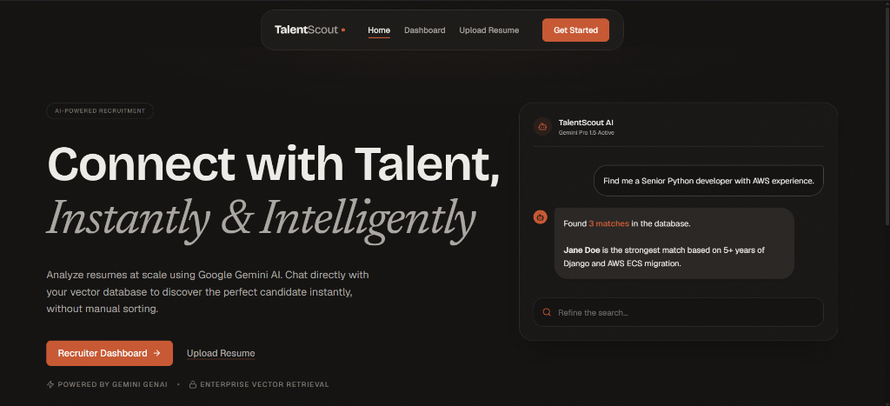
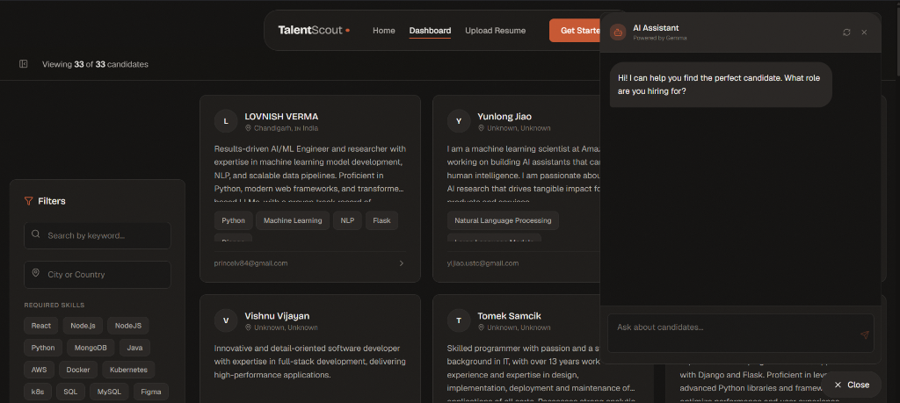
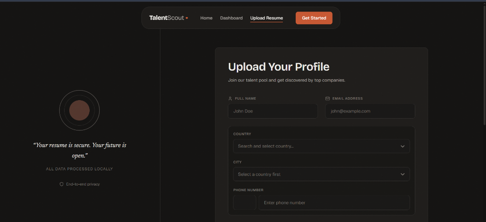

# TalentScout

**Connect with Talent, Instantly & Intelligently.**

An AI-powered recruitment platform that analyzes resumes at scale. Upload resumes, chat with your talent pool using Google Gemini AI, and discover the perfect candidate instantly — without manual sorting.

[](https://www.typescriptlang.org/)
[](https://react.dev/)
[](https://nextjs.org/)
[](https://www.mongodb.com/)
[](https://vercel.com/)
[](https://ai.google.dev/)

---



## Overview

Recruiters spend hours manually scanning resumes to find the right hire. **TalentScout** eliminates that bottleneck.

When a resume is uploaded, it's automatically parsed, analyzed by Gemini AI to extract skills and summaries, and embedded into a Pinecone vector database. Recruiters can then search the entire talent pool using plain English — _"Find me a Senior Python developer with AWS experience"_ — and get ranked, contextual results in seconds through a conversational AI assistant.

No keyword matching. No boolean filters. Just intelligent, semantic search over your entire candidate pipeline.

---

## Key Features

- **AI Resume Analysis** — Resumes are parsed, cleaned, and analyzed by Gemini AI. Skills, summaries, and vector embeddings are extracted automatically.
- **Semantic Search (RAG)** — Ask questions in plain English. The RAG pipeline searches across vectorized resumes to find candidates that truly match your intent.
- **Conversational AI Assistant** — Chat directly with your talent pool. The Gemini-powered assistant provides structured comparisons, highlights relevant experience, and suggests follow-up actions.
- **Instant Ranking** — Get compatibility scores and structured comparisons. Make data-driven hiring decisions without reading every resume.
- **Smart Filtering** — Filter candidates by keyword, location, and required skills with an interactive sidebar.
- **Model Fallback** — Automatically switches between Gemini models if quota limits are hit or a model is unavailable, ensuring zero downtime.

---

## Screenshots

<table>
  <tr>
    <td width="50%">
      
      <p align="center"><strong>Recruiter Dashboard</strong> — Browse candidates, filter by skills, and chat with the AI Assistant.</p>
    </td>
    <td width="50%">
      
      <p align="center"><strong>Upload Resume</strong> — Submit a profile with PDF upload, location picker, and contact details.</p>
    </td>
  </tr>
</table>

---

## Architecture & Tech Stack

```
┌─────────────────────────────────────────────────────────────────┐
│                        CLIENT (React 19)                        │
│  Next.js App Router  ·  Tailwind CSS  ·  Framer Motion          │
└──────────────────────────────┬──────────────────────────────────┘
                               │  API Routes
┌──────────────────────────────▼──────────────────────────────────┐
│                     SERVER (Next.js API)                         │
│                                                                 │
│  ┌─────────────┐   ┌──────────────────┐   ┌─────────────────┐  │
│  │  Resume API  │   │   Query Service   │   │  Gemini Client  │  │
│  │  (upload,    │   │   (RAG pipeline,  │   │  (embeddings,   │  │
│  │   parse PDF) │   │    chat routing)  │   │   extraction,   │  │
│  └──────┬───────┘   └────────┬─────────┘   │   generation)   │  │
│         │                    │              └────────┬────────┘  │
└─────────┼────────────────────┼─────────────────────┼────────────┘
          │                    │                      │
    ┌─────▼─────┐      ┌──────▼──────┐        ┌──────▼──────┐
    │  MongoDB   │      │  Pinecone   │        │  Gemini AI  │
    │  (profiles │      │  (vector    │        │  (LLM +     │
    │   & meta)  │      │   search)   │        │  embedding) │
    └────────────┘      └─────────────┘        └─────────────┘
```

| Layer | Technology | Purpose |
| --- | --- | --- |
| **Framework** | Next.js 16 (App Router) | Full-stack React with server-side API routes |
| **Language** | TypeScript | End-to-end type safety |
| **AI** | Google Gemini API | LLM chat, resume extraction, embeddings |
| **Vector DB** | Pinecone | Semantic similarity search over resume embeddings |
| **Database** | MongoDB (Mongoose) | Persistent storage for candidate profiles |
| **Styling** | Tailwind CSS + Framer Motion | UI design system and animations |
| **Deployment** | Vercel | Edge-optimized hosting with zero-config deploys |

---

## Getting Started

### Prerequisites

- [Node.js](https://nodejs.org/) v18+
- A [MongoDB Atlas](https://www.mongodb.com/atlas) cluster
- A [Pinecone](https://www.pinecone.io/) account (free tier works)
- A [Google Gemini API key](https://aistudio.google.com/)

### 1. Clone the repository

```bash
git clone https://github.com/devkarx/TalentScout.git
cd TalentScout
```

### 2. Install dependencies

```bash
npm install
```

### 3. Configure environment variables

Copy the sample file and fill in your credentials:

```bash
cp .env.sample .env
```

```env
# MongoDB Atlas connection string
MONGODB_URI=mongodb+srv://<username>:<password>@cluster0.example.mongodb.net/<dbname>

# Pinecone vector database
PINECONE_API_KEY=your_pinecone_api_key_here
PINECONE_INDEX_NAME=resumes-tracker

# Google Gemini AI
GEMINI_API_KEY=your_gemini_api_key_here
```

> **Where to get your keys:**
>
> - **Gemini API Key** → [Google AI Studio](https://aistudio.google.com/)
> - **Pinecone API Key** → [Pinecone Console](https://app.pinecone.io/)
> - **MongoDB URI** → [MongoDB Atlas](https://cloud.mongodb.com/)

### 4. Start the development server

```bash
npm run dev
```

Open [http://localhost:4000](http://localhost:4000) in your browser.

---

## Environment Variables

| Variable | Required | Description |
| --- | --- | --- |
| `MONGODB_URI` | ✅ | MongoDB Atlas connection string |
| `PINECONE_API_KEY` | ✅ | Pinecone API key for vector operations |
| `PINECONE_INDEX_NAME` | ✅ | Name of the Pinecone index (default: `resumes-tracker`) |
| `GEMINI_API_KEY` | ✅ | Google Gemini API key for AI features |

> The Pinecone index is auto-created on first resume upload if it doesn't exist (768-dimension, cosine metric, AWS us-east-1 serverless).

---

## Project Structure

```
├── app/
│   ├── api/
│   │   ├── resumes/        # Resume upload, parsing, and retrieval
│   │   └── query/          # AI chat & semantic search endpoint
│   ├── recruiter/          # Recruiter dashboard page
│   ├── upload/             # Resume upload form page
│   ├── models/             # Mongoose schemas
│   ├── lib/                # App-level utilities
│   ├── layout.tsx          # Root layout with Navbar & Footer
│   └── page.tsx            # Landing / Hero page
│
├── components/
│   ├── ui/                 # Navbar, Footer, GlassCard, Button
│   ├── recruiter/          # Dashboard-specific components
│   └── countryCitySelector/# Location picker widget
│
├── lib/
│   ├── infra/
│   │   ├── gemini.ts       # Gemini AI client, embeddings, extraction
│   │   ├── pinecone.ts     # Pinecone client & index accessor
│   │   └── mongodb.ts      # MongoDB connection singleton
│   ├── services/
│   │   ├── resume.service.ts  # PDF parse → clean → embed → upsert pipeline
│   │   └── query.service.ts   # Intent detection → RAG search → LLM response
│   ├── types/              # Shared TypeScript interfaces
│   └── constants.ts        # Model lists, embedding config, skills taxonomy
│
└── public/                 # Static assets
```

---

## Deployment

TalentScout is optimized for **Vercel** with zero-configuration deployment:

1. Push your repository to GitHub.
2. Import the project in [Vercel](https://vercel.com/new).
3. Add the environment variables listed above in **Settings → Environment Variables**.
4. Deploy. Vercel automatically detects the Next.js framework and builds accordingly.

> Server-external packages (`mongoose`, `pdf-parse`, `@pinecone-database/pinecone`) are pre-configured in `next.config.mjs` for seamless serverless deployment.

---

## Contributing

Contributions are welcome! Here's how to get started:

1. **Fork** the repository.
2. Create a feature branch: `git checkout -b feat/your-feature`.
3. Commit your changes: `git commit -m "feat: add your feature"`.
4. Push to your fork: `git push origin feat/your-feature`.
5. Open a **Pull Request** with a clear description of your changes.

Please make sure your code follows the existing TypeScript conventions and passes `npm run lint` before submitting.

---

## License

This project is open source and available under the [MIT License](LICENSE).

---

<p align="center">
  Built with intention by <a href="https://github.com/devkarx">devkarx</a>
</p>
